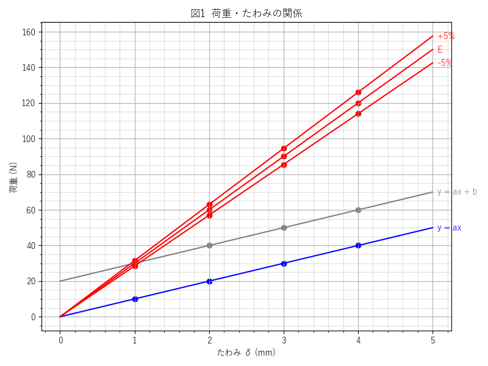

<h3>構造力学 荷重・たわみ関係</h3>

荷重・たわみ関係は、材料が外力に対してどのように変形するかを示す基本的な関係式です。今回の実験演習では、**なぜか** グラフを手書きさせられてるので、`matplotlib`でプロットを支援するスクリプトです。
**なぜ、手書きなのかは不明**です。**なぜ、手書きなのかは不明**です。**なぜ、手書きなのかは不明**です。**なぜ、手書きなのかは不明**です。私の大学の実験演習に合わせて作成しているスクリプトであるため、他の環境では全く適さないでしょう。あくまでこちらのリポジトリは、私的の備忘録であり、第三者の利用や改変を想定していません。

<br>

<h3>実行環境</h3>

<b>以下の手順より、ターミナルを実行し環境を整えます。</b>

<h4>1. Clone</h4>

```bash
git clone https://github.com/Sakamochanq/Structural-Mechanics-plots.git
cd Structural-Mechanics-plots/src
```

<h4>2. package</h4>

```bash
uv add matplotlib numpy
```

<h4>3. run</h4>

```bash
uv run main.py
```

<br>

<h3>仕組み</h3>

標準の`matplotlib`では、軸ラベルやタイトルなどのオブジェクトは日本語表記に対応していないため、システム内からフォントを呼び出し、matplotlibに設定しています。開発環境に依存すると思いますが、**japanize-matplotlib**は使用出来なかったため、応急措置として、こちらの方法を採用しました。

```py
# ./assets/lang.pyから呼び出し
import assets.lang as lang
lang.set_font(font_name=None or lang.find_japanese_font())
```

<br>

x軸はたわみ(ς)、y軸は荷重(P)を表し、与えられたヤング率(E)に基づいて直線グラフを描画します。今回は実験に合わせてx軸たわみの範囲（RANGE変数）を0~5に設定してます。

```py
RANGE = 5
x_line = np.linspace(0, RANGE, 100)

y1_line = a*x_line + b
y2_line = a*x_line
y3_line = E*x_line
y4_line = (E*1.05)*x_line
y5_line = (E*0.95)*x_line
```

<br>

<div align="center">
    <a href="#">
        
    </a>
</div>

<br>
<hr>
<br>

<h3>著者</h3>

[Sakamochanq](https://github.com/Sakamochanq) - Developer

<br>
